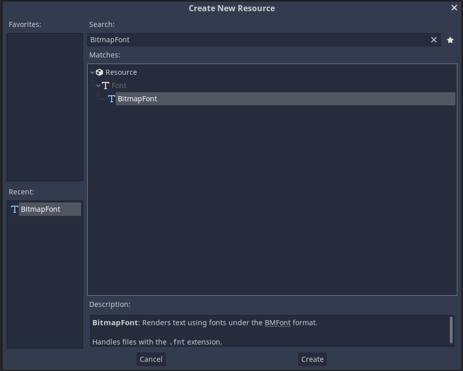
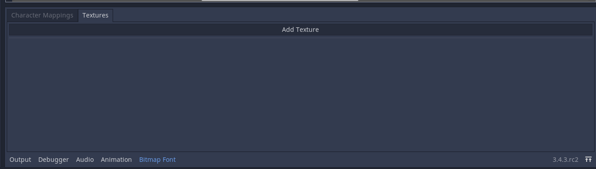
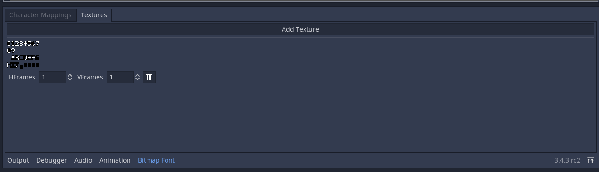
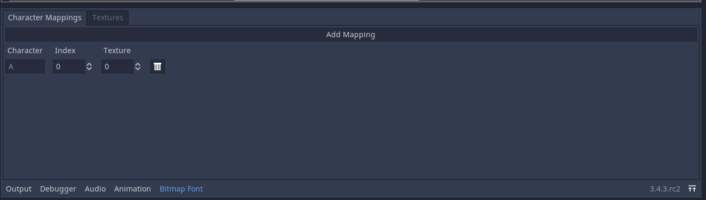
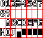

# bitmap-font-creator
A plugin for Godot 3.x, used to create bitmap fonts.

To use this plugin, simply copy the `bitmap_font_creator` folder to your own Godot project's `addons` folder. Then go into your project settings, plugins, and enable the plugin called "Bitmap Font Creator".

## Creation of a Bitmap Font

To use this plugin, simply create or open a `BitmapFont` resource.

Pick a name for your font and save it. Once you do there should be a new window at the bottom.

### Textures

Click on the tab that says `Textures`.

Click on `Add Texture`--it will bring up a file selection dialog with which you can choose any supported texture resource. Click on the image containing the font atlas and click OK.

This should now popup:

It may be a little hard to see, but there is a texture with some font characters drawn. The next step is to specify how many rows and how many columns there are in the texture. If you've messed with `SpriteFrame`s before, you know what to do.

In this example, the texture has 8 Hframes and 4 VFrames. So that is what you'd put in if using the example texture.

You can add more textures if you want. You can also delete the texture by clicking on the button with the trashcan icon.

Now for the next step...

### Character Mappings

Click on the tab that says "Character Mappings", then click the button that says "Add Mapping".

Similarly to the textures, you can delete character mappings using the trashcan button.

This is where you define where in the image each character is found. First you type in the character you want to map to the texture. The next two fields require an explanation.

The *index* specifies which cell in the selected texture to use for the character. Remember the HFrames and VFrames from earlier? Use those to count from the topleft cell to the one that contains the correct glyph. For example, if I wanted to map the character `5` to the corresponding cell, I'd count from the very first cell until the one with the 5 in it.

Going off of this image, the cell with the 5 is located on the sixth cell; however, because we count from zero, we would put in 5 as the index.

Put a number identifying the *texture* you want to use--in this example, you'd put in 0. The first texture that appears in the other tab is texture 0, the second one texture 1, and so on.

Add more character mappings. Once you are satisfied, save the scene to also save any changes to the font.
