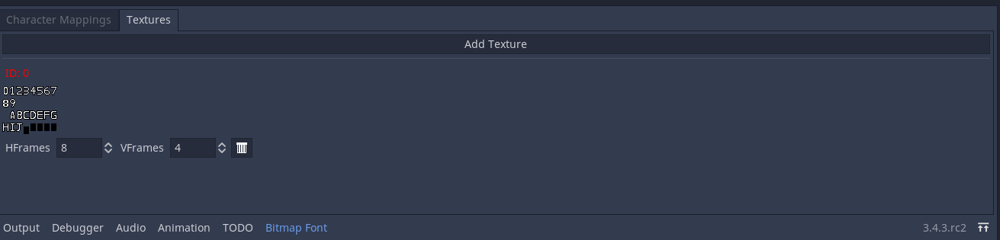
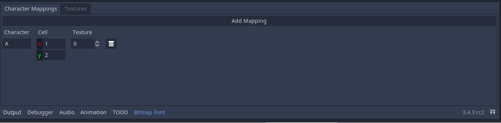

# bitmap-font-creator
A plugin for Godot 3.x, used to create bitmap fonts.

To use this plugin, simply copy the `bitmap_font_creator` folder to your own Godot project's `addons` folder. Then go into your project settings, plugins, and enable the plugin called "Bitmap Font Creator".

The first time you enable the plugin, a new setting is added to your project settings. As of right now, the settings are grouped under "Bitmap Font Plugin".

## Version 1.0

This is the first production-ready version of the plugin. You can use it in your project and it will work without too many issues. Of course, bus are bound to show up, so please report the bug if you come across it.

## Creation of a Bitmap Font

To use this plugin, simply create or open a `BitmapFont` resource.

Pick a name for your font and save it. Once you do there should be a new window at the bottom.

In the "Textures" tab, you can see the textures that are used by the font. If you just created the font, nothing will be there. Click on the "Add Texture" button to open a file dialog. Once you've chosen a texture it will show in the window (see example below).

*An example of a texture*

Textures are displayed in a grid, and each texture has an associated ID. The first texture has an ID of 0, the second an ID of 1, and so on. The ID of the texture is displayed in a red label on top of the image. You will use that ID when mapping characters to the texture.

In the "Character Mappings" tab, click on "Add Mapping" to add a new character to the font. Type in the character you wish to add along with the cell it's located in. Finally, specify the ID of the texture you want to use (see above).

*An example of a character mapping*
