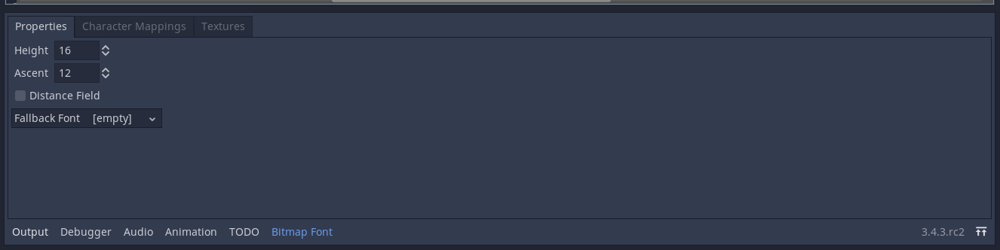
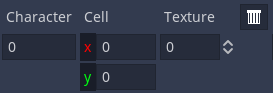
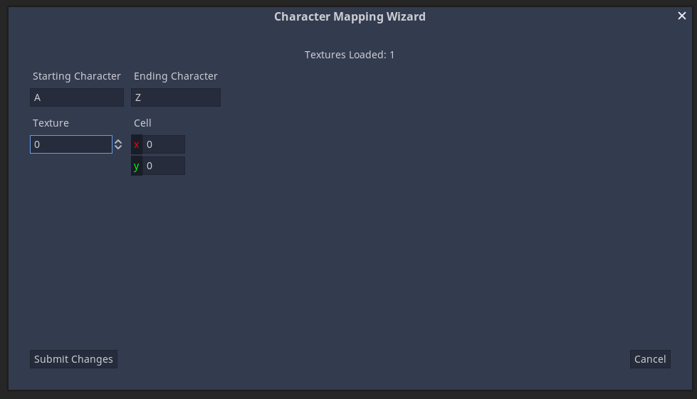

# Bitmap Font Creator

A plugin for Godot 3.x, used to create bitmap fonts.

To use this plugin, simply copy the `bitmap_font_creator` folder to your own Godot project's `addons` folder. Then go into your project settings, plugins, and enable the plugin called "Bitmap Font Creator".

The first time you enable the plugin, a new setting is added to your project settings. That setting is under "Bitmap Font Plugin".

**Note:** The first time you enable the plugin, you may get errors saying that `BFCHelpers` is not defined in scope. If that happens, just disable and reenable the plugin; that will fix all the errors.

## Version 1.1

See the [curated changelog](CHANGELOG.md) to see how this version is different from version 1.0.

## How To Use

To use this plugin, simply create or open a `BitmapFont` resource.

Pick a name for your font and save it. Once you do there should be a new window at the bottom.

### Properties

Click on the "Properties" tab to access the properties of the font.

You will notice that the inspector no longer shows the properties under `BitmapFont`. This was done because I could not make the inspector work with my plugin. Instead you can edit those properties here.

### Textures

Add one or more textures to the font under the "Textures" tab. After adding the texture, specify how many columns (h frames) and rows (v frames) there are in the image. This step is needed in order to specify the cell in a texture. The first cell is (0, 0); increment the X as you go right, and increment the Y as you go down.

Each texture as its own "ID" (though index is more the correct name). If you want to map a character to a given texture, you use this number to reference it.

### Characters

Add a character to the font by clicking on "Add Mapping", then fill in the options below.

#### Options

* "Character" is the character you want to add: just type it into the entry.
* "Cell" is the cell the character is found in.\*
* "Texture" is the index of the texture (see same section).\*

\* See the section called ["Textures"](#textures) to understand what these mean.

- - -

To save all your changes to the font, just save the current scene (Control+s in most cases).

### Character Mapping Wizard

In the "Character Mappings" tab, click on "Launch Character Map Wizard". After confirming your choice, the bottom panel will disappear, and a new dialog will popup.

This lets you insert a series of characters in a range very easily and very quickly. To use it just type in the first and last character in the range. The ranges are based off of the unicode values for characters, so 'A' must go before 'Z', 'a' before 'z', and so on.

Like before, "Texture" is the ID/index of the texture you want to use. "Cell" is the location of the cell where the starting character is located. The cells for each of the other characters is figured out automatically. Click "Submit Changes" to insert the characters into the font.

If there are no errors, then the dialog will close with no further messages. Open the font again and your changes should be seen.
